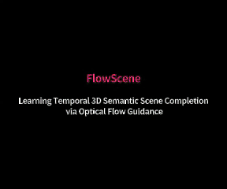

# FlowScene
[NeurIPS 25] Learning Temporal 3D Semantic Scene Completion via Optical Flow Guidance

# Teaser
- **Comparison with VoxFormer on SemanticKITTI:**
<p align="center">

</p>

# Abstract
3D Semantic Scene Completion (SSC) provides comprehensive scene geometry and semantics for autonomous driving perception, which is crucial for enabling accurate and reliable decision-making. However, existing SSC methods are limited to capturing sparse information from the current frame or naively stacking multi-frame temporal features, thereby failing to acquire effective scene context. These approaches ignore critical motion dynamics and struggle to achieve temporal consistency. To address the above challenges, we propose a novel temporal SSC method FlowScene: Learning Temporal 3D Semantic Scene Completion via Optical Flow Guidance. By leveraging optical flow, FlowScene can integrate motion, different viewpoints, occlusions, and other contextual cues, thereby significantly improving the accuracy of 3D scene completion. Specifically, our framework introduces two key components: (1) a Flow-Guided Temporal Aggregation module that aligns and aggregates temporal features using optical flow, capturing motion-aware context and deformable structures; and (2) an Occlusion-Guided Voxel Refinement module that injects occlusion masks and temporally aggregated features into 3D voxel space, adaptively refining voxel representations for explicit geometric modeling. Experimental results demonstrate that FlowScene achieves state-of-the-art performance, with mIoU of 17.70 and 20.81 on the SemanticKITTI and SSCBench-KITTI-360 benchmarks. 

# Step-by-step Installation Instructions

Following https://mmdetection3d.readthedocs.io/en/latest/getting_started.html#installation

**a. Create a conda virtual environment and activate it.**
python > 3.7 may not be supported, because installing open3d-python with py>3.7 causes errors.
```shell
conda create -n flowscene python=3.7 -y
conda activate flowscene
```

**b. Install PyTorch and torchvision following the [official instructions](https://pytorch.org/).**
```shell
conda install pytorch==1.10.1 torchvision==0.11.2 torchaudio==0.10.1 cudatoolkit=11.3 -c pytorch -c conda-forge
```

**c. Install gcc>=5 in conda env (optional).**
I do not use this step.
```shell
conda install -c omgarcia gcc-6 # gcc-6.2
```

**c. Install mmcv-full.**
```shell
pip install mmcv-full==1.4.0
```

**d. Install mmdet and mmseg.**
```shell
pip install mmdet==2.14.0
pip install mmsegmentation==0.14.1
```

**e. Install mmdet3d from source code.**

Refer to occformer's mmdetection3d installation method.
Please check your CUDA version for [mmdet3d](https://github.com/open-mmlab/mmdetection3d/issues/2427) if encountered import problem. 

**f. Install other dependencies.**
```shell
pip install timm
pip install open3d-python
pip install PyMCubes
pip install spconv-cu113==2.3.6
pip install clip==1.0
```

**g. Install natten.**
```shell
cd ./projects/mmdet3d_plugin/occupancy/modules/natten/src
python setup.py install
```
# Prepare Data

- **a. You need to download**

     - The **Odometry calibration** (Download odometry data set (calibration files)) and the **RGB images** (Download odometry data set (color)) from [KITTI Odometry website](http://www.cvlibs.net/datasets/kitti/eval_odometry.php), extract them to the folder `data/occupancy/semanticKITTI/RGB/`.
     - The **Velodyne point clouds** (Download [data_odometry_velodyne](http://www.cvlibs.net/download.php?file=data_odometry_velodyne.zip)) and the **SemanticKITTI label data** (Download [data_odometry_labels](http://www.semantic-kitti.org/assets/data_odometry_labels.zip)) for sparse LIDAR supervision in training process, extract them to the folders ``` data/lidar/velodyne/ ``` and ``` data/lidar/lidarseg/ ```, separately. 


- **b. Prepare KITTI voxel label (see sh file for more details)**
```
bash process_kitti.sh
```

# Pretrained Model

Download the [RepViT-M2.3-300e](https://github.com/THU-MIG/RepViT/releases/download/v1.0/repvit_m2_3_distill_300e.pth).


# Training & Evaluation

## Single GPU
- **Train with single GPU:**
```
export PYTHONPATH="."  
python tools/train.py   \
            projects/configs/occupancy/semantickitti/FlowScene_semantickitti.py
```

- **Evaluate with single GPUs:**
```
export PYTHONPATH="."  
python tools/test.py  \
            projects/configs/occupancy/semantickitti/FlowScene_semantickitti.py \
            pretrain/checkpoint.pth 
```


## Multiple GPUS
- **Train with n GPUs:**
```
bash tools/dist_train.sh  \
        projects/configs/occupancy/semantickitti/FlowScene_semantickitti.py n
```

- **Evaluate with n GPUs:**
```
 bash tools/dist_test.sh  \
            projects/configs/occupancy/semantickitti/FlowScene_semantickitti.py \
            pretrain/checkpoint.pth  n
```

# Citation
If you find this project useful in your research, please consider cite:
```
@inproceedings{wang2025vlscene,
  title={VLScene: Vision-Language Guidance Distillation for Camera-Based 3D Semantic Scene Completion},
  author={Wang, Meng and Fan, Wu and Li, Ruihui and Qin, Yunchuan and Tang, Zhuo and Li, Kenli},
  booktitle={NeurIPS},
  year={2025}
}
```

# Acknowledgements
Many thanks to these excellent open source projects: 
- [VLScene](https://github.com/willemeng/VLScene)
- [GMFlow](https://github.com/haofeixu/gmflow)
- [MonoScene](https://github.com/astra-vision/MonoScene)
- [mmdet3d](https://github.com/open-mmlab/mmdetection3d)
- [StereoScene](https://github.com/Arlo0o/StereoScene/tree/main)
- [OccFormer](https://github.com/noticeable/OccFormer/tree/main)
- [RepViT](https://github.com/THU-MIG/RepViT)

